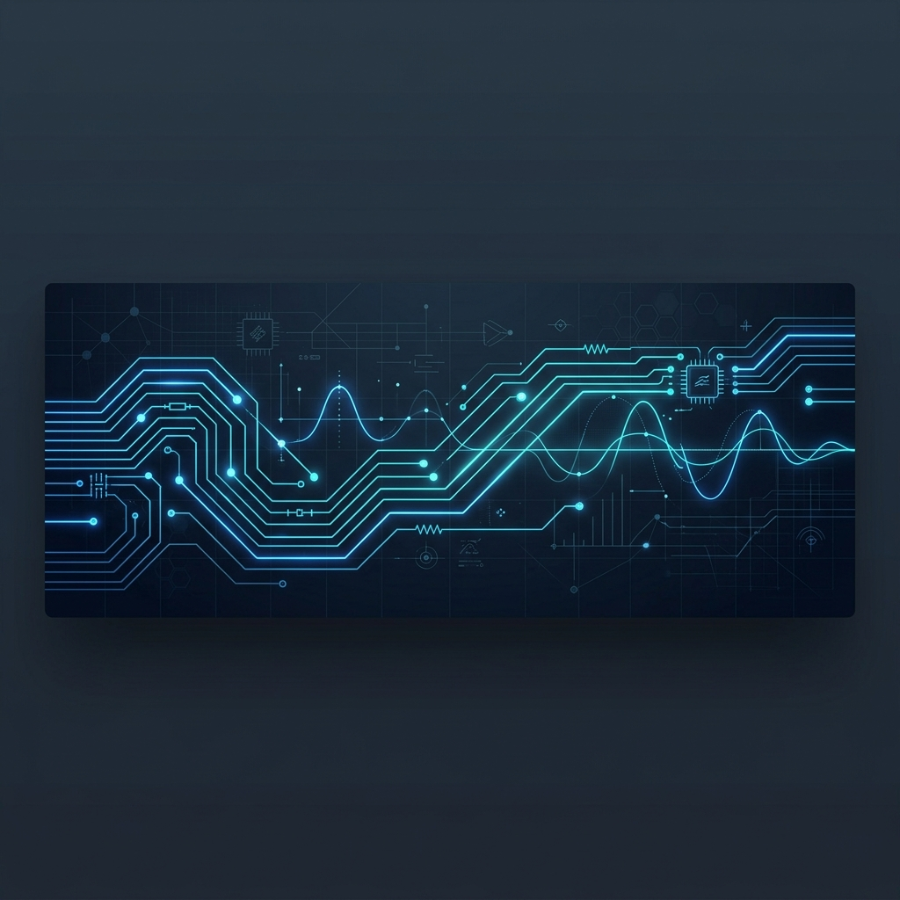

<!-- Sleek, High-Tech GitHub Profile README for mn11667 -->

  

<h1 align="center">Hi there, I'm Madhav Neupane! 👋</h1>

  <strong>Electrical Engineering Graduate | Industrial Automation & Embedded Systems Enthusiast</strong>

  
  &nbsp;&nbsp;
  

---

### 🚀 Engineering Perspective

I enjoy exploring how engineering can be used to solve real-world problems. My primary interests lie in **automation**, **embedded systems**, **control engineering**, and **power systems**, alongside technical documentation and report writing. 

I believe in continuous learning, teamwork, and collaboration, and I am always eager to master new technologies and apply them to practical engineering challenges.

---

### 🛠️ Technical Skills

  
<strong>Industrial Automation & Embedded Systems</strong>

   
  
  
  
  

  
<strong>Engineering Software & Programming</strong>

   
  
  
  
  
  
  
  

  
<strong>Electrical Engineering Core</strong>

   
  
  
  

---

### 📂 Featured Projects

*   **Unified Transformer Protection and Partial Discharge Localization**
    *   Developed concepts related to transformer fault detection, protection, and condition monitoring.
    *   Explored diagnostic techniques for improving transformer reliability and maintenance planning.
    *   Studied partial discharge monitoring approaches for asset health assessment.
*   **PLC and Industrial Automation Learning Projects**
    *   Developed virtual PLC ladder logic programs for industrial control applications.
    *   Implemented motor control, timer, counter, sequencing, and interlocking/latching logic.
    *   Explored PLC-SCADA integration concepts using Ignition SCADA.
*   **Embedded Systems Projects**
    *   Developed sensor-based automation and monitoring systems.
    *   Implemented UART communication and embedded debugging applications.
    *   Performed boot sequence monitoring and embedded diagnostics.

---

### 📊 GitHub Stats Dashboard

  
  &nbsp;&nbsp;
  

  

---

### 📬 Connect with Me

*   **Email:** [madhavneupane6789@gmail.com](mailto:madhavneupane6789@gmail.com) | [078bel097.madhav@pcampus.edu.np](mailto:078bel097.madhav@pcampus.edu.np)
*   **ResearchGate:** [Madhav Neupane Profile](https://www.researchgate.net/profile/Madhav-Neupane-6)
*   **Location:** Lalitpur, Nepal

  

